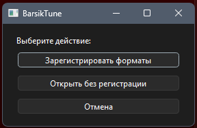
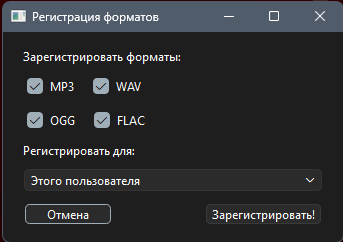
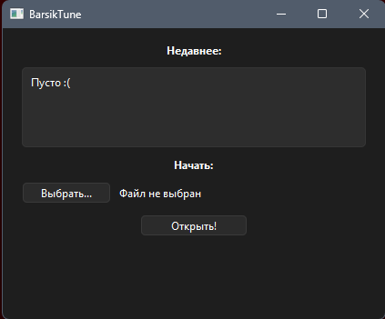
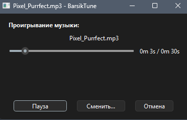

<!--
    BarsikTune - Плеер Барсика
    Файл создал: @barsik0396
-->
# 🎵 ***BarsikTune*** - Плеер **Барсика**

## 📃 *Краткое* **описание**

***BarsikTune*** это open-source музыкальный плеер Барсика. Тут минимальный функционал но и есть всё нужное.

# 🪟 Скриншоты
   

# ⤵️ Последние **релизы**
| Название      | Версия         | Скачать           |
|---------------|----------------|-------------------|
| **First meow**    | 1.0 "**Первый мяу**" | **Нет ссылки**      |

# 🚀 Первые **шаги**
1. **Скачиваем** с [оффициального *сайта*](https://barsik0396.github.io/BarsikTune/download?ver=1.0)
2. Запускаем **установщик**
3. Следуем **инструкциям** на **экране**
4. **Запускаем**
5. **Регистрируем**, если до этого не зарегистрировали
6. **Открываем** файл и проверяем!
7. **100%** - Всё готово!